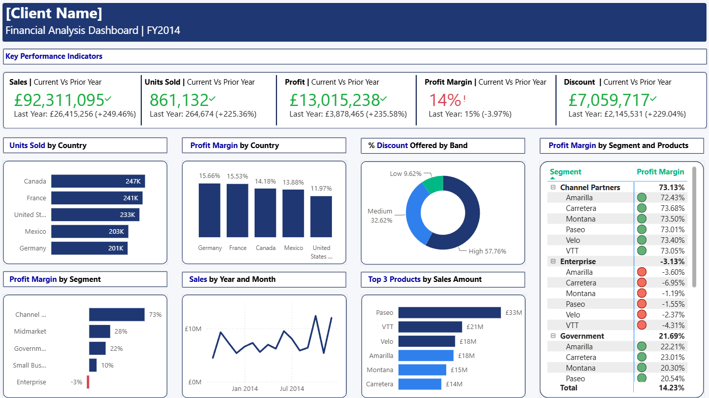

# Financial Analysis Dashboard (Power BI)

Interactive financial reporting dashboard built using Power BI, DAX, and Power Query.

  

## Overview

This project is an interactive Financial Analysis Dashboard built in Power BI to provide insights into business performance across sales, profitability, discounts, products, countries, and customer segments.

The dashboard enables stakeholders to monitor key financial KPIs, identify trends, compare performance against the previous year, and evaluate profitability across different areas of the business.

---

## Objectives

- Track overall business performance using key financial metrics.
- Compare current year results against the previous year.
- Analyse profitability across countries, segments, and products.
- Identify top-performing products and regions.
- Monitor discount distribution and its impact on profitability.
- Present financial information in a clear and interactive format.

---

## Key Performance Indicators (KPIs)

The dashboard tracks the following KPIs:

- Sales Amount
- Units Sold
- Profit
- Profit Margin
- Discount Amount

Each KPI includes:

- Current Year Performance
- Previous Year Comparison
- Year-over-Year Growth Analysis

---

## Dashboard Features

### Sales Analysis

- Sales performance by country
- Monthly sales trend analysis
- Top-performing products by sales value
- Year-over-year sales comparison

### Profitability Analysis

- Profit margin by country
- Profit margin by customer segment
- Profit margin by product
- Profitability comparison across business areas

### Discount Analysis

- Discount distribution by discount band
- Discount performance monitoring
- Discount impact analysis

### Product Performance

- Top-performing products by sales amount
- Product profitability comparison
- Product ranking visualisations

---

## Tools & Technologies

- Power BI Desktop
- DAX (Data Analysis Expressions)
- Power Query
- Data Modelling
- Time Intelligence Functions
- Microsoft Excel

---

## Data Model

A star schema data model was implemented to support efficient reporting and time-based analysis.

### Fact Table

- Financials

### Dimension Tables

- Date

The Date table was used to support time-intelligence calculations and year-over-year comparisons.

---

## DAX Measures Created

Examples of measures used throughout the dashboard include:

- Sales Amount
- Sales Amount LY
- Units Sold
- Units Sold LY
- Profit
- Profit LY
- Profit Margin
- Profit Margin LY
- Total Discount Amount

Time-intelligence calculations were implemented to compare current performance against prior-year results.

---

## Key Insights

- Sales increased significantly year-over-year.
- Profit growth remained strong while profit margin slightly declined.
- Certain customer segments generated substantially higher profit margins than others.
- Product performance varied significantly across the portfolio.
- Discount distribution highlighted potential opportunities to improve profitability.

---

## Skills Demonstrated

- Dashboard Design & Data Visualisation
- Financial Performance Analysis
- KPI Development
- Business Intelligence Reporting
- DAX Measure Creation
- Time Intelligence Calculations
- Data Modelling
- Power Query Data Transformation
- Analytical Storytelling
- Data-Driven Decision Support

---

## Files Included

### Dashboard

- `Financial_Dashboard_Project.pbix` – Power BI report file
- `Financial_Dashboard.png` – Dashboard preview image

### Dataset

- Source financial dataset used for analysis and reporting

---

## Project Outcome

This dashboard demonstrates the ability to transform raw financial data into actionable business insights through effective data modelling, DAX calculations, and interactive visualisations. The report is designed to support stakeholders in monitoring performance, identifying trends, and making informed business decisions.
